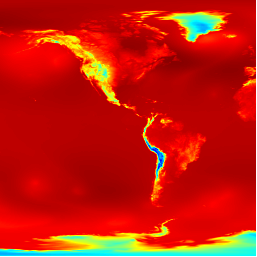
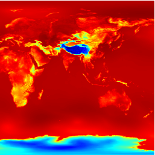

# What is mapcache ?

"MapCache is a server that implements tile caching to speed up access to WMS layers. The primary objectives are to be fast and easily deployable, while offering the essential features (and more!) expected from a tile caching solution." 

> [Source : www.mapserver.org/mapcache ](http://www.mapserver.org/mapcache/)


> [Slideshare](http://fr.slideshare.net/tbonfort/modgeocache-mapcache-a-fast-tiling-solution-for-the-apache-web-server)

# How to use this image

## Build mapcache docker image

This image is built under ubuntu 14.04.
```
$ git clone https://github.com/pamtrak06/mapcache-ubuntu14.04.git
$ cd mapcache-ubuntu14.04; mkdir data; mkdir data/maps; mkdir data/conf;  
$ docker build -t pamtrak06/mapcache-ubuntu14.04:latest .
```

Embedded wmts example from Data source : Environnement Canada, (licence)[http://dd.meteo.gc.ca/doc/LICENCE_GENERAL.txt]

## Run mapcache docker container

Run container
```
$ cd mapcache-ubuntu14.04;
$ docker run --name [your container name] -d -t -p 8686:80 -v $(pwd)/data:/data pamtrak06/mapcache-ubuntu14.04 bash
```

Run container with link to mapserver container
```
$ cd mapcache-ubuntu14.04;
$ docker run --name [your container name] --link [your mapserver container name]:mapserver -d -t -p 8686:80 -v $(pwd)/data:/data pamtrak06/mapcache-ubuntu14.04 bash
```


Open a terminal session on a running container
```
$ docker ps
$ docker exec -d pamtrak06/mapcache-ubuntu14.04 /bin/bash
```

Exit container without stop it
```
CTRL+P  &  CTRL+Q
```

Get docker vm ip frm windows or mac : 
```
$ docker-machine env default
export DOCKER_TLS_VERIFY="1"
export DOCKER_HOST="tcp://192.168.99.101:2376"
export DOCKER_CERT_PATH="/Users/jp/.docker/machine/machines/default"
export DOCKER_MACHINE_NAME="default"
# Run this command to configure your shell: 
# eval "$(docker-machine env default)"
```

WMS GetCapabilities
```
http://<host ip>/mapcache/?service=wms&request=getCapabilities
```


WMTS GetCapabilities
```
http://<host ip>/mapcache/wmts/?service=wmts&request=getCapabilities
```

GetTile

Take care about replacing time with syntaxe time=[actual year]-[actual month]-[actual day]T[hour]:00:00Z

Tips : Read available time in capabilities

```
http://<host ip>/mapcache/wmts/?service=WMTS&request=GetTile&format=image/png&width=1600&height=600&srs=EPSG:4326&layer=GDPS.ETA_P0_PRESSURE&TileMatrixSet=WGS84&TileMatrix=0&TileRow=0&TileCol=0&time=[time]

http://<host ip>/mapcache/wmts/?service=WMTS&request=GetTile&format=image/png&width=1600&height=600&srs=EPSG:4326&layer=GDPS.ETA_P0_PRESSURE&TileMatrixSet=WGS84&TileMatrix=0&TileRow=0&TileCol=1&time=[time]
```



## Configure container
Mapcache configuration file could be fully modified or replaced.
Prerequisite : open a terminal session in the container.

```
$ vi /etc/apache2/conf-available/mapcache.xml
```
configure mapcache.xml with help from http://mapserver.org/fr/mapcache/config.html,
and then after modification restart apache server like
```
$ apachectl restart
```

Take care about mapcache cache strategy (with type="disk" all is stored in container)

Mapcache configuration file could be generate from script mapcache-run.sh, arguments are :
```
$ cd /etc/apache2/conf-available/
$ ./mapcache.sh <wms url> <project name>
```
Example :
```
$ cd /etc/apache2/conf-available/
$  ./mapcache.sh http://geo.weather.gc.ca/geomet/?lang=E geometca
$ ls -la mapcache.xml
```

Build a mapcache configuration from capabilities in javascript with help from http://pamtrak06.github.io/mapPower/build-mapcache.html

Example of parsing a WMS capabilities from WMS data source, (licence : environnement Canada) to build a mapcache.xml configuration file for Mapcache (tile WMTS server).

Connect to container :
```
$ docker exec -it $(docker ps | grep pamtrak06/mapcache-ubuntu14.04 | cut -d ' ' -f1 ) bash
```

Test http responses in the container :
```
$ ps -ef | grep apache
$ curl localhost
$ curl localhost/mapcache
$ curl localhost/mapcache/?service=wms&request=getCapabilities
$ curl localhost/mapcache/wmts/?service=wmts&request=getCapabilities
```
